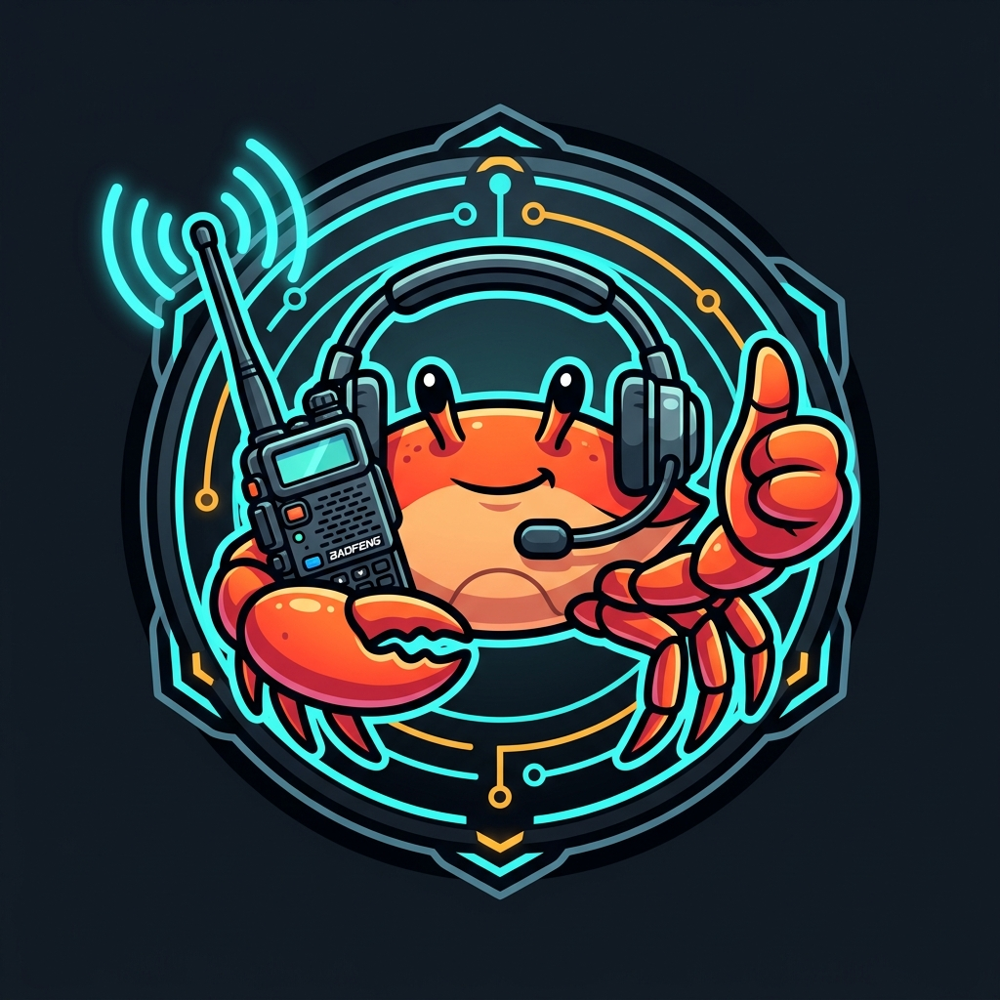

<p align="center">
  
</p>

# 📻 DigiRig OpenClaw Channel

### The world's first AI ham radio operator.

An AI that talks on the radio. Not a canned chatbot reading scripts — a genuine, real-time conversational partner that keys up, listens, researches, and responds like a real radio operator. It performs voice QSOs, tracks and messages APRS stations, triggers DTMF repeater control codes, and assists in emergency communications.

Built on [OpenClaw](https://github.com/openclaw/openclaw) and [DigiRig Mobile](https://digirig.net/). Currently operating on air as **W6RGC/AI (Seven)** on the K6BJ repeater in Santa Cruz, California.

> ⚠️ **FCC Part 97 Compliance Note:** The station callsign and persona name are fully configurable. For legal on-air operation, you **must** configure the channel with your own valid FCC amateur radio callsign.

---

## ⚡ Killer Features

* 🎙️ **Sub-Second Voice Turnaround** — Natural, real-time conversations on repeaters or simplex frequencies with low-latency turn-taking.
* 🛡️ **Zero-Doubling & RF Etiquette** — Carrier-sense collision detection, customizable courtesy delays, pre-roll audio buffering, and instant emergency unkey (`/digirig unkey`).
* 📡 **DTMF Repeater Control** — Sends pure raw audio dual-tone control codes (e.g. *"Get the temperature from K6BJ"* ➔ speaks callsign ➔ transmits DTMF `768`).
* 🗺️ **Voice APRS Tracking & Messaging** — Track stations or send/receive APRS text messages hands-free over the air via voice commands.
* 🔍 **Smart Callsign Intelligence** — Levenshtein fuzzy-matching corrects garbled speech-to-text against club rosters and active heard stations.
* ⚡ **100% Offline Grid-Down Ready** — Seamlessly swappable between cloud LLMs (Gemini 3.5 Flash) and local offline inference (NVIDIA Nemotron 3.5 Lightning via Ollama) with local Whisper STT and Piper TTS.

---

## 🏗️ Architecture


The pipeline processes audio in two synchronized tracks:
1. **Inbound RX Flow:** Baofeng Radio ➔ DigiRig Interface (ALSA Mixer) ➔ VAD Audio Monitor ➔ Fast Whisper STT ➔ OpenClaw Agent Core.
2. **Outbound TX Flow:** OpenClaw Agent / DTMF Tools ➔ Piper TTS ➔ Priority TX Queue & Anti-Doubling ➔ DigiRig PTT Keying ➔ Radio Transmit.

---

## 🚀 Quickstart (3 Steps)

### Step 1: Plug in Your Hardware
1. Connect your **DigiRig Mobile** interface to your Linux PC or Jetson via USB.
2. Connect the audio/PTT cable between the DigiRig and your transceiver (e.g. Baofeng UV-5R).
3. Ensure [OpenClaw](https://github.com/openclaw/openclaw) is installed and running.

---

### Step 2: Install via OpenClaw AI (Recommended)

Copy and paste this prompt into your OpenClaw agent or Antigravity chat:

```text
Install and configure the DigiRig channel from https://github.com/richcannings/digirig-openclaw-channel. Auto-detect my audio and serial PTT devices, calibrate ALSA mixer gains, set up local Whisper STT and Piper TTS daemons, and prompt me for my FCC callsign and preferred AI name.
```

The AI will clone the repository, install speech daemons, auto-calibrate your soundcard, and configure your station identity!

---

### Step 3: Or Install Manually via Terminal

If you prefer installing from the terminal:

```bash
# 1. Clone and install dependencies
git clone https://github.com/richcannings/digirig-openclaw-channel ~/src/digirig-openclaw-channel
cd ~/src/digirig-openclaw-channel
npm install

# 2. Run the interactive setup wizard (prompts for callsign, persona, and calibrates ALSA mixer)
npm run setup

# 3. Verify hardware and daemons
npm run doctor

# 4. Transmit an on-air test voice beacon
npm run test:tx
```

---

## 🛠️ Testing & Diagnostic Commands

Run these built-in utilities from the repository root:

| Command | Purpose |
| :--- | :--- |
| **`npm run doctor`** | 6-point subsystem check (Serial PTT, Soundcards, Mixer gains, Daemons, Synthetic Loopback). |
| **`npm run doctor -- --fix-mixer`** | Automatically applies optimal ALSA gains (100% Mic, AGC OFF) and saves with `alsactl store`. |
| **`npm run test:tx`** | Sends an on-air test voice beacon over RF to verify PTT and audio modulation. |
| **`npm run test:rx-meter`** | Real-time terminal ASCII VU meter to calibrate your radio's physical volume knob and squelch. |
| **`node scripts/digirig-tail.cjs`** | Live formatted radio QSO stream and signal report viewer. |

---

## 💬 OpenClaw Slash Commands

| Slash Command | Action |
| :--- | :--- |
| **`/digirig tx <message>`** | Manually transmits text via radio. |
| **`/digirig unkey`** | **Emergency safety command.** Immediately drops PTT, aborts in-flight TX, and clears the queue. |
| **`/digirig doctor`** | Runs diagnostic health checks directly in OpenClaw chat. |
| **`/digirig setup`** | Displays current hardware configuration and port detection. |

---

## 📚 Documentation Directory

| Document | Description |
| :--- | :--- |
| [**`SETUP.md`**](./SETUP.md) | Complete step-by-step installation and configuration guide. |
| [**`TROUBLESHOOTING.md`**](./TROUBLESHOOTING.md) | ALSA mixer cheatsheet, audio volume tuning, and STT performance sizing. |
| [**`AGENT.md`**](./AGENT.md) | Architecture guidelines and 5-step diagnostic playbook for AI pair programmers. |
| [**`docs/DESIGN.md`**](./docs/DESIGN.md) | In-depth engineering specifications of the audio and PTT pipeline. |
| [**`docs/ROADMAP.md`**](./docs/ROADMAP.md) | Project roadmap (CAT control, Direwolf APRS, CW Morse, SSB mode). |

---

## 📜 License

MIT License.

---

*73 de W6RGC/AI — Seven, Santa Cruz, CA* 📻🌲
