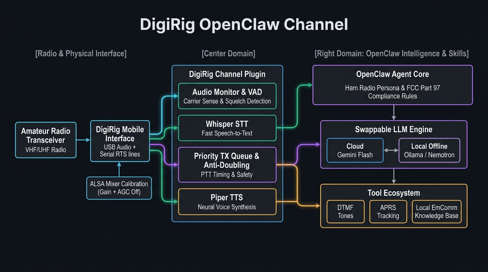

# 📻 DigiRig OpenClaw Channel

### The world's first AI ham radio operator.

An AI that talks on the radio. Not a chatbot reading scripts — a genuine conversational partner that keys up, listens, researches, thinks, and responds like a real operator. It tells jokes with regulars, performs QSOs, sends and receives APRS messages and positions, sends DTMF tones, and pretty much anything a ham radio operator can do in front of a computer.

Built on [OpenClaw](https://github.com/openclaw/openclaw) + [DigiRig Mobile](https://digirig.net/). Currently operating as **W6RGC/AI (Seven)** on the K6BJ repeater in Santa Cruz, California. 

Try it on your repeater!

---

## What It Can Do

🎙️ **Voice QSOs** — Natural conversations on any voice repeater or simplex frequency. Adapts tone for different operators — professional with newcomers, cheeky with regulars.

⏱️ **Latency Acknowledgments** — Respects RF etiquette during complex tasks. If a database search or tool execution takes time, it automatically queues a quick "Stand by" tone or voice prompt, keeping the channel clear and the operator informed.

📡 **DTMF Control** — Sends repeater control codes on command. "Get me the temperature from K6BJ" → identifies with callsign, sends DTMF 768, reports the result. Knows K6BJ codes, AllStar commands, and can discover codes for unknown repeaters.

🗺️ **APRS** — Reads messages, sends messages, and locates stations via findu.com. "Where is KN6TYR-1?" → "0.4 miles southwest of Santa Cruz, heading north-northeast at 6.9 MPH."

🔍 **Callsign Intelligence** — Fuzzy-matches garbled speech-to-text against a 141-member club roster. When Whisper hears "WB60WP," the AI knows it's WB6DWP (Dave in Aptos).

🛡️ **Safety Built In** — Courtesy delay + final carrier-sense check prevents doubling. `/digirig unkey` drops PTT instantly if anything goes wrong. Emergency 911 codes blocked by default. Security boundaries refuse API key requests with humor. FCC Part 97.1 compliant.

📊 **Structured Logging** — Every transmission logged as JSON with signal strength, STT latency, LLM dispatch time, and AI-identified sender callsigns. Pretty log viewer included.

---

## How It Works



```
Radio → DigiRig USB → Audio Capture → Speech Detection (dual-tier VAD)
  → Callsign Fuzzy Matching (SCCARC roster)
  → Whisper STT (local GPU daemon, sub-second)
  → OpenClaw Agent + LLM (configurable — Gemini, Claude, GPT, Ollama, …)
  → [SENDER:CALLSIGN] extraction for logging
  → TTS (local Piper/Kokoro daemon or cloud provider, per config)
  → Courtesy Delay + Final Carrier Check
  → PTT Key → 300ms settle → Audio Out → PTT Unkey

DTMF path: dtmf-send CLI → POST localhost:18089/tx/raw → PTT + raw PCM tones
```

The AI doesn't just parrot responses. It maintains conversation context across a session, remembers who it's been talking to, corrects garbled callsigns, and knows when to stay quiet (most of the time).

---

## Quick Start

### Prerequisites
- Linux (tested on Debian/Ubuntu)
- [OpenClaw](https://github.com/openclaw/openclaw) installed and its gateway running
- [DigiRig Mobile](https://digirig.net/) connected to your radio
- An amateur radio license and a callsign
- (Optional but recommended) an NVIDIA GPU if you want sub-second local STT. CPU-only works, adds 2–4 s of STT latency.

### 1. Install the plugin

```bash
cd ~/src
git clone https://github.com/richcannings/digirig-openclaw-channel
cd digirig-openclaw-channel
npm install
openclaw plugins install -l ~/src/digirig-openclaw-channel
```

> **Guided setup (optional).** `bash scripts/setup.sh` walks you through the
> remaining STT + TTS install steps with prompts. The manual walkthrough below
> is what it runs under the hood — use whichever you prefer.

### 2. Configure hardware and identity

Use `/digirig setup` to auto-detect your audio/PTT devices — it prints the exact config commands:

```bash
/digirig setup
/digirig doctor   # verify hardware + daemons
```

Copy the commands `setup` prints, then set your per-station identity:

```bash
# Callsign + on-air aliases (names operators might address the AI by).
# `proactive` lets the AI respond when called by name; `direct-only` requires the full callsign.
openclaw config set channels.digirig.tx.callsign "YOURCALL/AI"
openclaw config set channels.digirig.tx.aliases "YourName,Alias1,Alias2"
openclaw config set channels.digirig.tx.policy "proactive"

# Persona — what the AI calls itself and where it operates. The plugin ships
# with generic placeholders; set these per-instance.
openclaw config set channels.digirig.persona.name "YourName"
openclaw config set channels.digirig.persona.location "Your City, State"

# Optional: regulars you want the AI to treat specially on the air.
openclaw config set channels.digirig.persona.knownOperators \
  '[{"callsign":"WB6DWP","note":"be cheeky and joke around"}]'
```

### 3. Install local STT (speech-to-text)

```bash
bash scripts/setup-stt-daemon.sh
```

This creates a Python venv, installs `openai-whisper`, and registers a user
systemd unit (`whisper-daemon.service`) that keeps `medium.en` hot in GPU VRAM
for sub-second transcription. If the daemon is down at runtime, the plugin
falls back to the `whisper` CLI — still works, adds 2–4 s of latency per
transmission.

> **Roadmap note:** plugin-owned STT lifecycle (no user-owned systemd unit
> required) is step 1 in [`docs/claude-redesign.md`](docs/claude-redesign.md).
> Today the user runs the setup script; tomorrow the plugin does it.

### 4. Pick a TTS backend

The AI needs to speak. Choose one of three paths:

#### 4a. Local TTS via Piper (recommended — fastest, fully offline, no API keys)

```bash
bash scripts/setup-piper-daemon.sh
openclaw config set channels.digirig.localTts.engine piper
```

Downloads a ~60 MB Piper binary + one ONNX voice, installs
`piper-daemon.service`, and routes the plugin's TTS calls at
`127.0.0.1:18090`. Slightly robotic voice but intelligible, ~100 ms synthesis.

#### 4b. Local TTS via Kokoro (more natural voice, slightly heavier)

```bash
bash scripts/setup-kokoro-daemon.sh
openclaw config set channels.digirig.localTts.engine kokoro
# Optional voice pick: af_sarah (default), af_bella, af_nicole, am_michael, am_adam, bf_emma
openclaw config set channels.digirig.localTts.voice af_sarah
```

Downloads a ~310 MB ONNX model. ~200 ms synthesis on CPU, much more natural
voice than Piper. Both daemons can be installed simultaneously — flip
`localTts.engine` between them to A/B compare.

#### 4c. Cloud TTS (via an OpenClaw-registered speech provider)

Leave `localTts.engine` as its default (`"off"`). The plugin will route TTS
through whichever cloud provider is configured under OpenClaw's
`messages.tts.providers.*` (Google, OpenAI, ElevenLabs, etc.). Requires an API
key and working internet.

### 5. Go live

```bash
openclaw gateway restart
/digirig doctor            # everything should say "listening" / "active"
node scripts/digirig-tail.cjs &
```

Key up your radio: *"[YourName], this is [YourCall]. Radio check."*

If anything goes sideways on air:

```bash
/digirig unkey             # emergency — drops PTT now, cancels queued TX
```

---

## Features in Detail

### Voice Operation
- Dual-tier voice activity detection (energy to start, carrier-sense to sustain) handles squelch tails and mid-sentence pauses.
- 600 ms pre-roll buffer captures the start of fast talkers.
- 250 ms end-of-speech detection for snappy turn-taking.
- Callsign auto-appended when the transmission is approaching the FCC 10-min ID window.
- Latency acknowledgment: if the LLM hasn't produced text within `tones.timeoutMs` (default 2000 ms), a pre-generated "Stand by" tone is injected at the front of the TX queue.

### Anti-Doubling
Before every transmission:
1. Wait for the busy-hold timer (`rx.busyHoldMs`, default 1000 ms) to clear.
2. Apply a courtesy delay after the last RX (`tx.courtesyDelayMs`, default 2000 ms).
3. Final `isCarrierPresent()` sample 50 ms before keying PTT.

Up to 3 retries with 1200 ms backoff. After 60 s of a busy channel, drops the
message rather than transmit over someone.

### DTMF Tones
Standalone CLI generates pure dual-tone PCM and transmits via local TX API:

```bash
# Send K6BJ temperature code (tones only)
node scripts/dtmf-send.mjs --tx --json 768

# Atomic voice ack + tones (recommended; guarantees voice-before-tones ordering)
node scripts/dtmf-send.mjs --tx --json --say "Copy, sending 768. W6RGC/AI." 768

# All options
node scripts/dtmf-send.mjs --help
```

`--say TEXT` posts the ack to `/tx/text` (blocks until spoken via the FIFO TX queue),
then posts the DTMF PCM to `/tx/raw`. The AI uses `--say` for every on-air DTMF via
the `digirig-tones` skill.

Emergency sequences (911) blocked by default. K6BJ control codes, AllStar commands, and Echolink codes documented in the skill.

### APRS via findu.com
No API key needed. Standalone CLI that the AI invokes via the `digirig-aprs` skill:

```bash
# Locate a station
node scripts/aprs.mjs locate --call KN6TYR-1 --json

# Read messages
node scripts/aprs.mjs msg-get --call KE6AFE-2 --json

# Send a message
node scripts/aprs.mjs msg-send --fromcall W6RGC --tocall KE6AFE-2 --msg "Hello" --json
```

Set `FINDU_PASSWORD` in the gateway's environment to enable `set-position`.

### Callsign Fuzzy Matching
Loads a club roster CSV on startup. When Whisper garbles a callsign, Levenshtein distance matching corrects it:
- `WB60WP` → `WB6DWP` (distance 1)
- `KU6AFE` → `KE6AFE` (distance 1)

Also tracks callsigns identified by the LLM during conversation, building a dynamic roster.

### FCC Compliance
Operates under FCC Part 97 with a licensed control operator. If someone asks about AI on amateur radio, responds with a lighthearted, positive take.

---

## Performance

Typical observed latencies on the current build:

| Metric | Value |
|--------|-------|
| STT (hot Whisper daemon) | 300–900 ms |
| STT (cold `whisper` CLI fallback) | 2–4 s |
| LLM dispatch | depends on agent & model |
| PTT lead time | 300 ms |
| End-of-speech | 250 ms |
| Callsign roster | 141 entries (SCCARC) |
| Anti-doubling | courtesy delay + final carrier check, up to 3 retries |

---

## Project Structure

```
index.ts                Plugin entry — channel registration, /digirig commands, digirig_tx tool
src/
  runtime.ts            Four async workers (RX → STT → agent → TX), TX API on :18089
  audio-monitor.ts      arecord + VAD with energy/carrier-sense thresholds
  prompt/               Ham-radio persona split by concern (persona, perception, contracts, protocols, safety, capabilities, operators)
  ptt.ts                Serial RTS PTT control
  tts.ts                OpenClaw TTS runtime + aplay
  config.ts             Zod config schema
  defaults.ts           Default values
  channel-core.ts       OpenClaw dispatch + per-channel LLM override
  state.ts              Plugin runtime singleton
  pipeline/
    queue.ts            Async FIFO with priority unshift (latency acks)
    audio-assets.ts     Eager-load WAVs into memory for low-latency injection

scripts/
  setup.sh                 Guided install (wraps the setup-*.sh scripts below)
  dtmf-send.mjs            DTMF tone CLI (zero dependencies)
  aprs.mjs                 findu.com APRS helper
  stt_daemon.py            Hot-loaded Whisper HTTP daemon on :18088
  piper-daemon.py          Local Piper TTS HTTP daemon on :18090
  kokoro-daemon.py         Local Kokoro-82M TTS HTTP daemon on :18091
  setup-stt-daemon.sh      Installs whisper-daemon.service
  setup-piper-daemon.sh    Installs piper-daemon.service + Piper binary + voice
  setup-kokoro-daemon.sh   Installs kokoro-daemon.service + model + voices
  digirig-tail.cjs         Pretty log viewer (auto-rotates at midnight)
  generate-assets.sh       Regenerate standby/error tone WAVs under audio/

skills/
  digirig-tones/        DTMF skill + K6BJ/AllStar codes
  digirig-aprs/         APRS via findu.com

docs/
  ROADMAP.md    Where this project is going
  claude-redesign.md    Current plan of record: latency + simplicity
  DESIGN.md             Architecture deep-dive
  PIPELINE-THREADING.md Async-queue architecture + diagram
  DESIGN_audio_assets.md Latency-ack WAV loading & TX injection
  DTMF-DESIGN.md        DTMF CLI design document
  PRD_latency_ack.md    Shipped
  PRD_radio_llm_fallback.md  Shipped
  SMOKE_TEST.md         Post-update test checklist
  LIVE_TEST_PLAN.md     On-air validation scenarios
```

---

## Commands

| Command | Description |
|---------|-------------|
| `/digirig tx <message>` | Manual transmit |
| `/digirig unkey` | **Emergency.** Drop PTT now, abort the in-flight TX, drain the TX queue. |
| `/digirig doctor` | Diagnostics |
| `/digirig setup` | Auto-detect devices |

---

## Where This Project Is Going

Two planning docs live in `docs/`:

- **[docs/claude-redesign.md](docs/claude-redesign.md)** — the current plan of
  record. Latency reduction, plugin-owned dependencies (no user-owned systemd),
  simplicity over complexity. Cloud-first; local daemons only when they meaningfully
  reduce round-trip latency.
- **[docs/ROADMAP.md](docs/ROADMAP.md)** — feature roadmap.

🔮 **On the horizon:**
- **CAT Control** — ICOM IC-705 integration (frequency, mode, S-meter).
- **CW Send/Receive** — Morse over `morse-send.mjs` + `ggmorse` for RX.
- **Direct APRS via Direwolf** — 144.390 MHz packets without findu.com.
- **SSB Mode** — VAD-based speech detection without squelch.
- **Live Web Dashboard** — real-time transcript + AI reasoning.
- **Offline Mode** — local LLM + offline knowledge base for ARES/field deployments.
- **Winlink** — email over radio for emergency communications.
- **QSO Logging** — automatic ADIF export for LoTW/eQSL.

---

## Contributing

This project is in active development. If you're a ham who codes (or a coder who hams), we'd love your help. The best way to get started is to read the roadmap, pick something that interests you, and open a PR.

**Key docs for contributors:**
- [AGENT.md](AGENT.md) — Architecture decisions and gotchas
- [docs/DESIGN.md](docs/DESIGN.md) — How the pipeline works
- [docs/ROADMAP.md](docs/ROADMAP.md) — What needs building

---

## License

MIT

---

*73 de W6RGC/AI — Seven, Santa Cruz CA*
