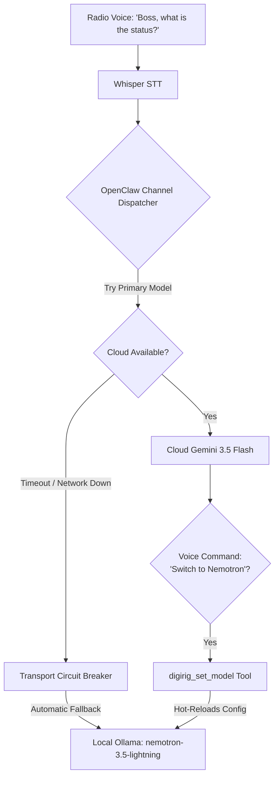

# Feature Specification: Dynamic On-Air Model Switching & Automatic Offline Circuit Breaker

**Status:** PROPOSED & DOCUMENTED (Do Not Implement Yet)  
**Target:** DigiRig OpenClaw Channel & MeshCore Channel  

---

## 1. Overview & Problem Statement

Operating an AI assistant over amateur radio (DigiRig) and off-grid LoRa (MeshCore) requires flexible control over which LLM is active (e.g. ultra-fast local `ollama/nemotron-3.5-lightning` vs. high-capability cloud `google/gemini-3.5-flash`).

### The "Offline Chicken-and-Egg" Dilemma
If the primary model is set to a cloud LLM (e.g. Gemini 3.5 Flash) and the internet goes down during a disaster, **the AI cannot "think" or execute an on-air tool to switch itself to local mode**, because the cloud request will simply fail.

---

## 2. Proposed Two-Tier Architecture

To solve this, model management is split into two distinct tiers:



---

## 3. Tier 1: Automatic Transport-Level Circuit Breaker (Zero-Thinking Fallback)

This operates at the **transport/network layer** before/during dispatch in `src/channel-core.ts`:

* **Network Watchdog:** When dispatching to the cloud LLM, if a network error occurs (`ENOTFOUND`, `ECONNREFUSED`, `ETIMEDOUT`, or HTTP 5xx), the dispatcher catches the error immediately.
* **Instant Failover:** Instead of emitting `error.wav` or dead air, the dispatcher silently re-routes the prompt to `channels.digirig.llm.offlineFallbackModel` (`ollama/nemotron-3.5-lightning`).
* **Tactical Announcement:** The prompt context can inject: `[System Notice: Operating on local backup logic via Nemotron]`, allowing the AI to naturally state: *"W6RGC, operating on local backup offline logic..."*
* **Auto-Revert:** When the internet connection is restored, the channel automatically re-promotes the cloud model as primary.

---

## 4. Tier 2: Intent-Driven On-Air Voice Model Switching (`digirig_set_model` Tool)

For intentional model selection during normal on-air operations:

* **Voice Command Examples:**
  * *"Boss, switch to local model."*
  * *"Boss, switch model to Nemotron."*
  * *"Boss, switch back to Gemini."*
* **Agent Tool Definition:**
  ```typescript
  api.registerTool({
    name: "digirig_set_model",
    description: "Switch the active LLM for the radio channel.",
    parameters: Type.Object({
      model: Type.String({ description: "Target model: 'nemotron', 'gemini', 'qwen', 'default'" })
    }),
    async execute(_id, { model }) {
      // Map aliases to full model identifiers
      // Hot-update channels.digirig.llm.model in openclaw config
      // Return voice ack confirmation
    }
  });
  ```
* **Hot-Reload:** Because `digirigPlugin` registers `reload: { configPrefixes: ["channels.digirig"] }`, modifying the configuration immediately applies to the very next transmission without restarting the gateway.

---

## 5. Summary of Key Benefits

1. **Disaster Survivability:** Even during an unannounced fiber cut or power outage, the radio channel never goes silent—it fails over to local Nemotron within 1.5 seconds.
2. **Hands-Free Control:** The operator can switch between cloud reasoning and local high-speed inference entirely via voice microphone.
3. **Bandwidth Optimization:** Quick local checks can run on Nemotron, reserving cloud tokens for deep multi-step research.
